```mermaid
flowchart TB
    subgraph current["JitterTestAnalyser.csproj"]
        MAIN["<b>⚙️&nbsp;JitterTestAnalyser.csproj</b><br/><small>net48</small>"]
        click MAIN "#jittertestanalyserjittertestanalysercsproj"
    end

```

# Projects and dependencies analysis

This document provides a comprehensive overview of the projects and their dependencies in the context of upgrading to .NETCoreApp,Version=v10.0.

## Table of Contents

- [Executive Summary](#executive-Summary)
  - [Highlevel Metrics](#highlevel-metrics)
  - [Projects Compatibility](#projects-compatibility)
  - [Package Compatibility](#package-compatibility)
  - [API Compatibility](#api-compatibility)
- [Aggregate NuGet packages details](#aggregate-nuget-packages-details)
- [Top API Migration Challenges](#top-api-migration-challenges)
  - [Technologies and Features](#technologies-and-features)
  - [Most Frequent API Issues](#most-frequent-api-issues)
- [Projects Relationship Graph](#projects-relationship-graph)
- [Project Details](#project-details)

  - [JitterTestAnalyser\JitterTestAnalyser.csproj](#jittertestanalyserjittertestanalysercsproj)

## Executive Summary

### Highlevel Metrics

| Metric | Count | Status |
| :--- | :---: | :--- |
| Total Projects | 1 | All require upgrade |
| Total NuGet Packages | 0 | All compatible |
| Total Code Files | 13 |  |
| Total Code Files with Incidents | 9 |  |
| Total Lines of Code | 2436 |  |
| Total Number of Issues | 1105 |  |
| Estimated LOC to modify | 1103+ | at least 45,3% of codebase |

### Projects Compatibility

| Project | Target Framework | Difficulty | Package Issues | API Issues | Est. LOC Impact | Description |
| :--- | :---: | :---: | :---: | :---: | :---: | :--- |
| [JitterTestAnalyser\JitterTestAnalyser.csproj](#jittertestanalyserjittertestanalysercsproj) | net48 | 🟡 Medium | 0 | 1103 | 1103+ | ClassicWinForms, Sdk Style = False |

### Package Compatibility

| Status | Count | Percentage |
| :--- | :---: | :---: |
| ✅ Compatible | 0 | 0,0% |
| ⚠️ Incompatible | 0 | 0,0% |
| 🔄 Upgrade Recommended | 0 | 0,0% |
| ***Total NuGet Packages*** | ***0*** | ***100%*** |

### API Compatibility

| Category | Count | Impact |
| :--- | :---: | :--- |
| 🔴 Binary Incompatible | 1099 | High - Require code changes |
| 🟡 Source Incompatible | 3 | Medium - Needs re-compilation and potential conflicting API error fixing |
| 🔵 Behavioral change | 1 | Low - Behavioral changes that may require testing at runtime |
| ✅ Compatible | 1774 |  |
| ***Total APIs Analyzed*** | ***2877*** |  |

## Aggregate NuGet packages details

| Package | Current Version | Suggested Version | Projects | Description |
| :--- | :---: | :---: | :--- | :--- |

## Top API Migration Challenges

### Technologies and Features

| Technology | Issues | Percentage | Migration Path |
| :--- | :---: | :---: | :--- |
| Windows Forms | 1049 | 95,1% | Windows Forms APIs for building Windows desktop applications with traditional Forms-based UI that are available in .NET on Windows. Enable Windows Desktop support: Option 1 (Recommended): Target net9.0-windows; Option 2: Add <UseWindowsDesktop>true</UseWindowsDesktop>; Option 3 (Legacy): Use Microsoft.NET.Sdk.WindowsDesktop SDK. |
| Legacy Data Access | 50 | 4,5% | LINQ to SQL and deprecated ADO.NET components that have been superseded by more modern data access technologies. LINQ to SQL was an early ORM that has been replaced by Entity Framework. Migrate to Entity Framework Core or modern ADO.NET. |
| Legacy Configuration System | 3 | 0,3% | Legacy XML-based configuration system (app.config/web.config) that has been replaced by a more flexible configuration model in .NET Core. The old system was rigid and XML-based. Migrate to Microsoft.Extensions.Configuration with JSON/environment variables; use System.Configuration.ConfigurationManager NuGet package as interim bridge if needed. |

### Most Frequent API Issues

| API | Count | Percentage | Category |
| :--- | :---: | :---: | :--- |
| T:System.Windows.Forms.Label | 131 | 11,9% | Binary Incompatible |
| T:System.Windows.Forms.ComboBox | 109 | 9,9% | Binary Incompatible |
| T:System.Windows.Forms.TabPage | 59 | 5,3% | Binary Incompatible |
| T:System.Windows.Forms.CheckBox | 58 | 5,3% | Binary Incompatible |
| T:System.Windows.Forms.Button | 46 | 4,2% | Binary Incompatible |
| P:System.Windows.Forms.Control.Name | 42 | 3,8% | Binary Incompatible |
| T:System.Windows.Forms.Control.ControlCollection | 40 | 3,6% | Binary Incompatible |
| P:System.Windows.Forms.Control.Controls | 40 | 3,6% | Binary Incompatible |
| M:System.Windows.Forms.Control.ControlCollection.Add(System.Windows.Forms.Control) | 40 | 3,6% | Binary Incompatible |
| P:System.Windows.Forms.Control.Size | 40 | 3,6% | Binary Incompatible |
| P:System.Windows.Forms.Control.TabIndex | 38 | 3,4% | Binary Incompatible |
| P:System.Windows.Forms.Control.Location | 38 | 3,4% | Binary Incompatible |
| T:System.Windows.Forms.TextBox | 30 | 2,7% | Binary Incompatible |
| T:System.Windows.Forms.RichTextBox | 23 | 2,1% | Binary Incompatible |
| P:System.Windows.Forms.ComboBox.Text | 17 | 1,5% | Binary Incompatible |
| T:System.Windows.Forms.GroupBox | 16 | 1,5% | Binary Incompatible |
| P:System.Windows.Forms.Label.Text | 13 | 1,2% | Binary Incompatible |
| T:System.Windows.Forms.TabControl | 13 | 1,2% | Binary Incompatible |
| P:System.Windows.Forms.Label.AutoSize | 13 | 1,2% | Binary Incompatible |
| M:System.Windows.Forms.Label.#ctor | 13 | 1,2% | Binary Incompatible |
| T:System.Data.Linq.Mapping.MappingSource | 11 | 1,0% | Binary Incompatible |
| P:System.Windows.Forms.CheckBox.Checked | 11 | 1,0% | Binary Incompatible |
| T:System.Windows.Forms.ProgressBar | 10 | 0,9% | Binary Incompatible |
| T:System.Windows.Forms.ComboBox.ObjectCollection | 9 | 0,8% | Binary Incompatible |
| P:System.Windows.Forms.ComboBox.Items | 9 | 0,8% | Binary Incompatible |
| P:System.Windows.Forms.ListControl.FormattingEnabled | 9 | 0,8% | Binary Incompatible |
| T:System.Windows.Forms.CheckState | 9 | 0,8% | Binary Incompatible |
| M:System.Windows.Forms.ComboBox.#ctor | 9 | 0,8% | Binary Incompatible |
| P:System.Windows.Forms.ButtonBase.UseVisualStyleBackColor | 8 | 0,7% | Binary Incompatible |
| P:System.Windows.Forms.ButtonBase.Text | 8 | 0,7% | Binary Incompatible |
| M:System.Data.Linq.DataContext.#ctor(System.String,System.Data.Linq.Mapping.MappingSource) | 6 | 0,5% | Binary Incompatible |
| M:System.Windows.Forms.Control.ResumeLayout(System.Boolean) | 6 | 0,5% | Binary Incompatible |
| T:System.Windows.Forms.AutoScaleMode | 6 | 0,5% | Binary Incompatible |
| M:System.Windows.Forms.Control.SuspendLayout | 6 | 0,5% | Binary Incompatible |
| T:System.Windows.Forms.BindingSource | 6 | 0,5% | Binary Incompatible |
| M:System.Windows.Forms.ComboBox.ObjectCollection.AddRange(System.Object[]) | 6 | 0,5% | Binary Incompatible |
| P:System.Data.Linq.IExecuteResult.ReturnValue | 5 | 0,5% | Binary Incompatible |
| T:System.Data.Linq.IExecuteResult | 5 | 0,5% | Binary Incompatible |
| M:System.Data.Linq.DataContext.ExecuteMethodCall(System.Object,System.Reflection.MethodInfo,System.Object[]) | 5 | 0,5% | Binary Incompatible |
| P:System.Windows.Forms.TextBox.Text | 5 | 0,5% | Binary Incompatible |
| M:System.Data.Linq.DataContext.#ctor(System.Data.IDbConnection,System.Data.Linq.Mapping.MappingSource) | 4 | 0,4% | Binary Incompatible |
| E:System.Windows.Forms.Control.Click | 4 | 0,4% | Binary Incompatible |
| M:System.Windows.Forms.Button.#ctor | 4 | 0,4% | Binary Incompatible |
| M:System.Windows.Forms.TextBoxBase.AppendText(System.String) | 4 | 0,4% | Binary Incompatible |
| M:System.Windows.Forms.Form.#ctor | 4 | 0,4% | Binary Incompatible |
| T:System.Windows.Forms.DialogResult | 4 | 0,4% | Binary Incompatible |
| T:System.Windows.Forms.Padding | 4 | 0,4% | Binary Incompatible |
| P:System.Windows.Forms.ButtonBase.AutoSize | 4 | 0,4% | Binary Incompatible |
| M:System.Windows.Forms.CheckBox.#ctor | 4 | 0,4% | Binary Incompatible |
| T:System.Data.Linq.ForeignKeyReferenceAlreadyHasValueException | 3 | 0,3% | Binary Incompatible |

## Projects Relationship Graph

Legend:
📦 SDK-style project
⚙️ Classic project

## Project Details

### JitterTestAnalyser\JitterTestAnalyser.csproj

#### Project Info

- **Current Target Framework:** net48
- **Proposed Target Framework:** net10.0-windows
- **SDK-style**: False
- **Project Kind:** ClassicWinForms
- **Dependencies**: 0
- **Dependants**: 0
- **Number of Files**: 16
- **Number of Files with Incidents**: 9
- **Lines of Code**: 2436
- **Estimated LOC to modify**: 1103+ (at least 45,3% of the project)

#### Dependency Graph

Legend:
📦 SDK-style project
⚙️ Classic project

### API Compatibility

| Category | Count | Impact |
| :--- | :---: | :--- |
| 🔴 Binary Incompatible | 1099 | High - Require code changes |
| 🟡 Source Incompatible | 3 | Medium - Needs re-compilation and potential conflicting API error fixing |
| 🔵 Behavioral change | 1 | Low - Behavioral changes that may require testing at runtime |
| ✅ Compatible | 1774 |  |
| ***Total APIs Analyzed*** | ***2877*** |  |

#### Project Technologies and Features

| Technology | Issues | Percentage | Migration Path |
| :--- | :---: | :---: | :--- |
| Legacy Configuration System | 3 | 0,3% | Legacy XML-based configuration system (app.config/web.config) that has been replaced by a more flexible configuration model in .NET Core. The old system was rigid and XML-based. Migrate to Microsoft.Extensions.Configuration with JSON/environment variables; use System.Configuration.ConfigurationManager NuGet package as interim bridge if needed. |
| Legacy Data Access | 50 | 4,5% | LINQ to SQL and deprecated ADO.NET components that have been superseded by more modern data access technologies. LINQ to SQL was an early ORM that has been replaced by Entity Framework. Migrate to Entity Framework Core or modern ADO.NET. |
| Windows Forms | 1049 | 95,1% | Windows Forms APIs for building Windows desktop applications with traditional Forms-based UI that are available in .NET on Windows. Enable Windows Desktop support: Option 1 (Recommended): Target net9.0-windows; Option 2: Add <UseWindowsDesktop>true</UseWindowsDesktop>; Option 3 (Legacy): Use Microsoft.NET.Sdk.WindowsDesktop SDK. |

